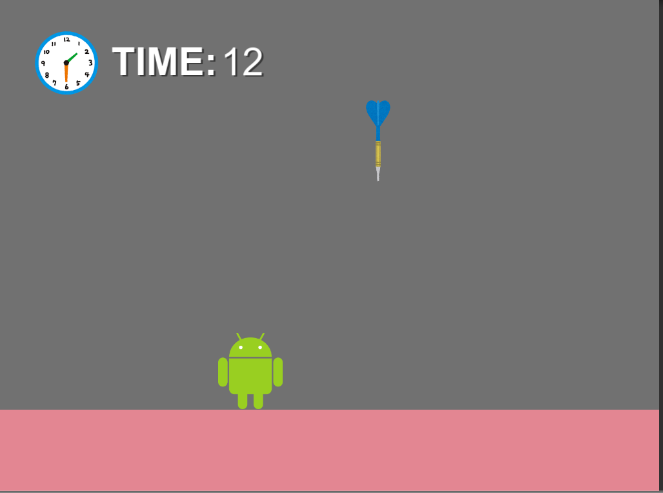

# このリポジトリは?

このリポジトリは、「矢をよけろ!」というゲームのソースコードを管理しているリポジトリです。  
現在ふりーむ!で公開しています。 

[ゲームダウンロードページへ](https://www.freem.ne.jp/win/game/22242)

# ビルドする際の注意点
このリポジトリには、著作権の関係上素材ファイルが含まれていません。(キャラクター画像、音楽ファイルなど)そのため、このプロジェクトをクローンしてビルドを行っても**正常に動作しません**。どのようなコードが書かれているのか参考にする目的でご使用ください。  
ゲームそのものを遊びたい方は、下のリンクからダウンロードしてください。

[ゲームダウンロードページへ](https://www.freem.ne.jp/win/game/22242)
# ソースコードが入っているフォルダ
ソースコードは、OchiGame-Assets-Scenesフォルダに含まれている、各フォルダにあります。  
# ライセンス
[MITライセンス](LICENSE)が適用されます。  